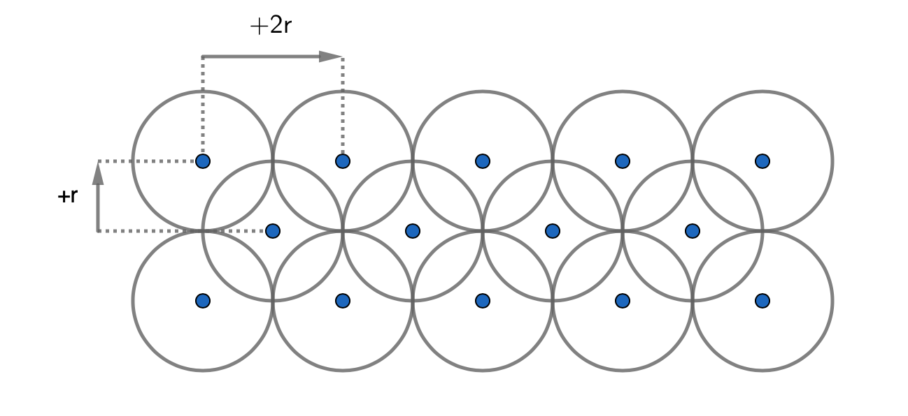
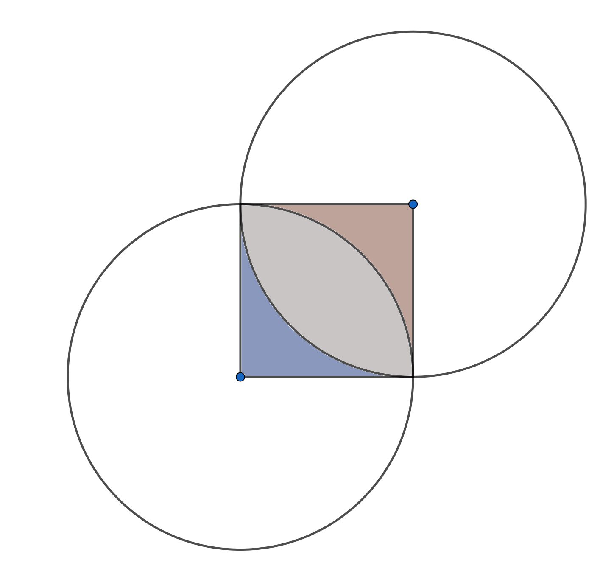

```{r}

library(data.table)
library(dplyr)
library(stringr)
library(sf)
library(tmap)
library(rmarkdown)
library(RColorBrewer)
library(leaflet)
library(stringi)

setwd(dirname(rstudioapi::getActiveDocumentContext()$path))
```


# Introduction {-}

Geolocation-based user generated data on social networks can be a gold mine to study urban dynamics. For instance, Mukhina, Rakitin and Visheratin (2017) used Instagram pictures to analyse differences in places visited by locals and tourists [@Mukhina2017]. Getting those kinds of data is however quite difficult, thankfully for our privacy protection.

Fortunately, the data of location review websites are public, and the most prominent of them, Google Places, offer an API to query the details for over 150 millions user created places around the world.

But even with this, there are strong limitations:

- Only 5 000 API calls per month are free.

- A maximum of 60 places can be retrieved per search.

- A maximum of 20 results can be retrieved per query. If there are more than 20 results, another query should be made to get the next results.

- Few fields are available by area place search.

- User written reviews are barely accessible.

# Data acquisition

## Function to query Google Maps API

A R package to query the Google Maps API is readily available on CRAN[@googleway] but I have chosen to code my own function, in order to better understand the URL construction and the JSON search responses of the API.

Compare to this package, I have added a csv file export as well as automatic subsequent new queries to get the next 20 results when it is needed. 

There is an interval of 10 seconds between each query to take into account the delay of generation of the JSON file, as described in the documentation[@googleAPI]: 

>There is a short delay between when a `next_page_token` is issued, and when it will become valid. Requesting the next page before it is available will return an `INVALID_REQUEST` response.

In addition, I have restricted the fields saved to only those which are useful for this study.

``` {r, eval=FALSE, echo=TRUE}
getPlaces <- function(APIKey, latitude, longitude, radius, savedir = NULL) {

  require(jsonlite)
  require(plyr)
  require(dplyr)
  
  baseUrl = "https://maps.googleapis.com/maps/api/place/nearbysearch/json?"
  location = paste0("location=", latitude, ","
                    , longitude, "&", "radius=", radius)
  
  i=0  
  
  assign(paste0("jsonResults",i),
        fromJSON(paste0(baseUrl, APIKey, "&", location)))

  while (exists("next_page_token", get(paste0("jsonResults",i)))) {
    token <- get("next_page_token", get(paste0("jsonResults",i)))
    i <- i + 1
    Sys.sleep(10)
    assign(paste0('jsonResults',i),fromJSON(paste0(baseUrl, APIKey, "&", 
                                      "pagetoken=", token)))
  }
  
  results <- as.data.frame(cbind(
    "Id" = jsonResults0$results$place_id,
    "Name" = jsonResults0$results$name,
    "Lat"= jsonResults0$results$geometry$location$lat,
    "Lng"= jsonResults0$results$geometry$location$lng,
    "Price_level" = jsonResults0$results$price_level,
    "Rating" = jsonResults0$results$rating,
    "Nb_Rating" = jsonResults0$results$user_ratings_total,
    "Type" = jsonResults0$results$types
  ))
  
  
  if(exists("jsonResults1")) {
  results <- rbind.fill(results, as.data.frame(cbind(
    "Id" = jsonResults1$results$place_id,
    "Name" = jsonResults1$results$name,
    "Lat"= jsonResults1$results$geometry$location$lat,
    "Lng"= jsonResults1$results$geometry$location$lng,
    "Price_level" = jsonResults1$results$price_level,
    "Rating" = jsonResults1$results$rating,
    "Nb_Rating" = jsonResults1$results$user_ratings_total,
    "Type" = jsonResults1$results$types
    )))
  }
  
  if(exists("jsonResults2")) {
    results <- rbind.fill(results, as.data.frame(cbind(
      "Id" = jsonResults2$results$place_id,
      "Name" = jsonResults2$results$name,
      "Lat"= jsonResults2$results$geometry$location$lat,
      "Lng"= jsonResults2$results$geometry$location$lng,
      "Price_level" = jsonResults2$results$price_level,
      "Rating" = jsonResults2$results$rating,
      "Nb_Rating" = jsonResults2$results$user_ratings_total,
      "Type" = jsonResults2$results$types
    )))
  }
  
  if (!is.null(savedir)) {
    filename <- paste0(savedir, "results-", latitude, "-", 
                       longitude, "-", radius, ".csv")
    results2 <- results
    results2$Type <- sapply(results$Type, paste, collapse = " ")
    results2 <- results2 %>% replace(.=="NULL", NA)
    results2 <- data.frame(sapply(results2,unlist))
    write.csv(results2, file = filename, row.names=FALSE)
  }
  
  results

}
```

## Spatial vector data for Paris

The lowest official decomposition of Paris is the "district". There are eighty districts, four for each of the twenty arrondissements. 

The Shapefile with administrative details for each district and their geospatial vector data is available on the open data website of the city of Paris[@quartier_paris].

I then filtered out all the arrondissements but the six of the North-East of Paris, the 9th, 10th, 11th, 18th, 19th and 20th.

``` {r, echo=TRUE}

Paris_by_district <- st_read("quartier_paris/quartier_paris.shp")

plot(st_geometry(Paris_by_district))

North_East <- Paris_by_district %>% filter(c_ar %in% c(9,10,11,18,19,20))

tm_shape(North_East) +
  tm_borders(col = "grey60", lwd = 0.5) +
  tm_fill(col = "c_ar", style="cat", title = "Arrondissement", 
          palette = brewer.pal(6, "Set3")) +
  tm_text(text = "l_qu", size = 0.6)

```

## Query parameters

### Grid generation

I tried to find the best solution to cover the maximal area using the minimum number of queries. What I naively thought at first sight to be a trivial problem, is in fact a field of research by itself, "circle packing" [@circle_packing].

The optimal solution would probably be given by the algorithm developed by Das (2006) [@Das2006], but I could not find any implementation already available in R.

In the absence of a better solution, I have used a staggered grid, as pictured below. 

{width=100%}

Let's consider the superposition between two circles. 

{width=100%}

The area in the square is $r^2$.

The area of the blue zone plus the grey zone is $\frac{\pi r^2}{4}$.

So the area of light brown zone - and similarly the area of the blue zone - is $r^2-\frac{\pi r^2}{4}$.

Thus the ratio between the grey area and the area of the square is equal to:

$\frac{r^2-2(r^2-\frac{\pi r^2}{4})}{r^2}=\frac{\pi}{2}-1\approx57\%$

This ratio is equal to the maximum superposition between all API calls using the staggered grid.

A superposition of 57% is probably very far from optimal but it can also be an advantage, given that in some very dense neighbourhoods of Paris there can be more than 60 places in even a small area, so some places may not be retrieved. Querying the same area twice may help mitigate this limitation.

I have written the function `getGrid` to generate the grid according to the parameters `north`, `east`, `south`, `west` and `radius_in_meters`. 

``` {r, echo=TRUE}

getGrid <- function(north, east, south, west, radius_in_meters) {
  
  radius_in_longitude <- radius_in_meters / 73000
  radius_in_latitude <- radius_in_meters / 111110
  
  grid <- data.frame(matrix(ncol = 3, nrow = 0))
  
  long <- 0
  lati <- 0
  index <- 0
  
  while (south + lati <= north) {
    while (west + long <= east) {
      
      grid <- rbind(grid, c(index, west + long, south + lati))
      index <- index + 1
      long <- long + 2 * radius_in_longitude
    }
    long <- 0
    lati <- lati + 2 * radius_in_latitude
  }
  
  long <- radius_in_longitude
  lati <- radius_in_latitude
  
  while (south + lati < north) {
    while (west + long < east) {
      
      grid <- rbind(grid, c(index, west + long, south + lati))
      index <- index + 1
      long <- long + 2 * radius_in_longitude
    }
    long <- radius_in_longitude
    lati <- lati + 2 * radius_in_latitude
  }
  
  names <- c("index", "longitude", "latitude")
  colnames(grid) <- names
  grid
  
} 

```

A conversion between degrees and meters is made.

A degree in latitude is always equal to 111 kilometers but a degree in latitude depends on the latitude of the region considered.

The length of 1° of longitude in kilometers is given by the formula below:

$1°longitude = 111 km * cos(latitude)$

Since Paris is at about 49° degrees of latitude,

$1°longitude = 111 km * cos(49) = 73km$

To find the parameters `north`, `east`, `south` and `west` for the `getGrid` function we use the bounding of the `Paris_by_district` object, given by the function `st_bbox`. They are the limits at the North, East, South and West of the city of Paris.

``` {r, echo=TRUE}
st_bbox(Paris_by_district)
```

By trial and error, I have found that the optimal `radius_in_meters` to cover the North-East of Paris in a maximum of 5 000 Google Maps API call is 52.5 meters.

The grid is generated for a whole rectangle around Paris, converted to an sf object and then the points are filtered to only keep those in the North East of Paris.

``` {r, echo=TRUE, warning=FALSE}
Grid_Paris <- getGrid(48.91, 2.47, 48.81, 2.22, 52.5) %>%
  st_as_sf(coords = c("longitude", "latitude"), crs = 4326) %>%
  st_filter(st_union(North_East$geometry))
nrow(Grid_Paris)
```

Exactly 4 964 points on the grid are generated. 

To plot the grid, the objects should projected to a planar projection instead of using geodetic coordinates (longitude and latitude degrees). 

The official projection in France is Lambert 93 [@Lambert93], its references are available on the spatialreference.org website [@spatial_reference].

``` {r, echo=TRUE}
Lambert <- st_crs("+proj=lcc +lat_1=49 
         +lat_2=44 +lat_0=46.5 +lon_0=3 +x_0=700000 
         +y_0=6600000 +ellps=GRS80 
         +towgs84=0,0,0,0,0,0,0 +units=m +no_defs")

North_East_Lambert <- North_East %>%
  st_transform(crs = Lambert) %>%
  st_geometry()

Grid_Paris_Lambert <- Grid_Paris %>%
  st_transform(crs = Lambert) %>%
  st_buffer(dist = 52.5) %>%
  st_geometry()

plot(North_East_Lambert, col = sf.colors(12, categorical = TRUE), 
     border = 'grey')
plot(Grid_Paris_Lambert, col = adjustcolor("skyblue", alpha.f=0.1), 
     border = 1, add = TRUE)
```

Using the leaflet package, it is also easily possible to create an interactive map of the grid previously generated. On the contrary to the plot function, leaflet use geodetic coordinates to work properly.

```{r, echo=TRUE}
Grid_Paris_Leaflet <- Grid_Paris_Lambert %>% 
  st_transform(crs = "+proj=longlat +datum=WGS84")

leaflet(Grid_Paris_Leaflet) %>%
  addTiles() %>% 
  addPolygons(color = "#444444", weight = 1, smoothFactor = 0.5,
              opacity = 1.0, fillOpacity = 0.5)
```

The grid is then saved to a csv file.

``` {r, eval=FALSE, echo=TRUE}
Grid_Paris_csv <- data.frame(do.call(rbind, st_geometry(Grid_Paris)))
Grid_Paris_csv <- cbind(Grid_Paris_csv, 52.5, 0)
names(Grid_Paris_csv) <- c("lon", "lat", "radius", "done")
write.csv2(Grid_Paris_csv, file = "grid.csv", row.names=FALSE)
```

### Google Maps query loop

Running 4964 queries was a long process with potential for instability, therefore the progress of the task was saved in a file at every loop to ensure the possibility to quickly resume it if it was stopped. Also every warnings and errors were logged.

It was executed on a virtual machine in a cloud environment, which was better fitted for long running tasks than a desktop computer.

``` {r, eval=FALSE, echo=TRUE}

Grid_Paris_csv <- read.csv2("grid.csv")

folder <- paste0(getwd(), "/Export/")

for (i in (1:nrow(Grid_Paris_csv))) {
  print(i)
  if (Grid_Paris_csv[i,'done'] == 0)
    {
    tryCatch(
      getPlaces(APIKey, Grid_Paris_csv[i,'lat'], Grid_Paris_csv[i,'lon'], 
               Grid_Paris_csv[i,'radius'], folder),
    warning = function(war) {
      write(as.character(Grid_Paris_csv[i,]), "log.txt", append = TRUE)
      write(paste("WARNING:", war), log, "log.txt", append = TRUE)},
    error = function(err) {
      write(as.character(Grid_Paris_csv[i,]), "log.txt", append = TRUE)
      write(paste("ERROR:", err), "log.txt", append = TRUE)})
    Grid_Paris_csv[i,'done'] <- 1
    write.csv2(Grid_Paris_csv, file = "grid.csv", row.names=FALSE)
    }
}

```

The running time of the process was 14 hours and it did not meet any issue.

# Spatial data visualisation and analysis

## Data cleaning

The 4 964 csv files previously generated are loaded.

``` {r, echo=TRUE}

files <- list.files(path = "Export", pattern = ".csv", full.names = TRUE)
places <- do.call(rbind, c(lapply(files, fread, encoding = "UTF-8"), fill = TRUE)) %>% as_tibble()
places

```

A total of 138 665 unique places has been queried.


``` {r, echo=TRUE, warning=FALSE}

places %>% 
  distinct(Type) %>% 
  filter(!str_detect(Type, "point_of_interest|establishment"))
````

Every places not listed as `point_of_interest` or `establishment` are streets or the city of Paris itself. The focus of this study is only on actual venues thus I filtered them out. 

I also removed the duplicates, transformed the `places` object to an sf object and filtered to keep only the locations within the limits of the North-East arrondissements.

``` {r, echo=TRUE, warning=FALSE}
places <-  places %>% 
  filter(str_detect(Type, "point_of_interest|establishment")) %>%
  distinct(Id, .keep_all = TRUE) %>% 
  st_as_sf(coords = c("Lng", "Lat"), crs = 4326) %>%
  st_intersection(North_East)

places 

```

``` {r}
rmarkdown::paged_table(places %>% as_tibble() %>% arrange(desc(Nb_Rating)) %>% dplyr::select(-Id)%>% mutate(Name = str_trunc(Name, 30, "right"), Type = str_trunc(Type, 50, "right")))

```

49 866 lines are removed, with 88 799 places remaining.

Finally I plotted them all using the `markerClusterOptions` options in Leaflet to group them.

```{r, echo=TRUE}

leaflet(places) %>% 
  addTiles() %>% 
  addMarkers(clusterOptions = markerClusterOptions(), 
             label = ~Name)
```

## Places density

Dplyr functions are used to compute the density of places by district and the result is plotted interactively using Leaflet.

```{r}

places_density <- places %>%
  as_tibble() %>%
  group_by(l_qu) %>%
  summarise(Count = n(), Rating = mean(Rating, na.rm = TRUE), 
            Nb_Rating = sum(Nb_Rating, na.rm = TRUE)) %>%
  left_join(North_East, by = "l_qu") %>%
  st_as_sf() %>%
  mutate(Density = 1000000 * Count / surface)

bins <- pretty(places_density$Density)
pal <- colorBin("YlOrRd", domain = places_density$Density, bins = bins)

labels <- sprintf(
  "<strong>%s</strong><br/>%.2f places / km<sup>2</sup>",
  places_density$l_qu, places_density$Density
) %>% lapply(htmltools::HTML)

leaflet(places_density) %>% 
  addTiles() %>%
  addPolygons(
    fillColor = ~pal(Density),
    weight = 2,
    opacity = 1,
    color = "white",
    dashArray = "3",
    fillOpacity = 0.7,
    highlight = highlightOptions(
      weight = 5,
      color = "#666",
      dashArray = "",
      fillOpacity = 0.7,
      bringToFront = TRUE),
    label = labels,
    labelOptions = labelOptions(
      style = list("font-weight" = "normal", padding = "3px 8px"),
      textsize = "15px",
      direction = "auto")) %>%
  addLegend(
    pal = pal, 
    values = ~Density, 
    opacity = 0.7, 
    title = NULL,
    position = "bottomright")

```

Faubourg-Montmartre is the most dense district for places listed on Google Maps. It is indeed a central and vibrant neighbourhood. 

On the contrary, Pont-de-Flandre is by far the least dense district, with 8 times less places by square kilometer than Faubourg-Montmartre. This is easily explained by the fact that almost half of the district is occupied by the Boulevard Périphérique, by the rails of the Gare de l'Est, and above all by the Parc de la Villette, the largest park of Paris intra-muros. The rest of the district is also mostly residential.

## Places density by type

First, the list of all possible types is retrieved.

``` {r, echo=TRUE}

space_split <- function (x) {
  strsplit(x, "[[:space:]]")
}

list_types <- places$Type %>% 
  space_split() %>% 
  unlist() %>% 
  unique() %>% 
  as_tibble() %>% 
  arrange(value)


```

``` {r}
rmarkdown::paged_table(list_types)
```
There are 104 different types.

``` {r, echo=TRUE}
places_count <- places %>% as_tibble() %>% summarise(Name = "all", N = n())

for (i in 1:nrow(list_types)) {
  places_count <- rbind(places_count, 
      places %>% 
      filter(str_detect(Type, paste0(list_types[i,1]))) %>%
      as_tibble() %>% 
      summarise(Name = paste0(list_types[i,1]), N = n())
    )
}

```

``` {r}
rmarkdown::paged_table(places_count)
```

``` {r, echo=TRUE, warning=FALSE}
top_10 <- places_count %>% 
  arrange(desc(N)) %>% 
  filter(!(Name %in% c("all","establishment", "point_of_interest"))) %>%
  top_n(10)
top_10
```

The top 10 most referenced types for places in Paris are:
- store
- health
- food
- restaurant
- finance
- doctor
- bar
- lodging
- real_estate_agency
- general_contractor

The leaflet library offers a possibility to add a filter, which is used to dynamically switch between those types.

```{r, echo=TRUE}

bins <- seq(0,1100,100)

pal <- colorBin("YlOrRd", bins = bins)

graph_by_type <- leaflet() %>% 
  addTiles() %>%
  addLegend(
    colors = pal(bins), 
    labels = bins, 
    opacity = 0.7, 
    title = NULL
  ) 

for (i in 1:10) {
  assign(paste0("places_",top_10[i,1]), places %>%
    as_tibble() %>%
    filter(str_detect(Type,paste0(top_10[i,1]))) %>%
    group_by(l_qu) %>%
    summarise(Count = n(), Rating = mean(Rating, na.rm = TRUE), 
              Nb_Rating = sum(Nb_Rating, na.rm = TRUE)) %>%
    left_join(North_East, by = "l_qu") %>%
    st_as_sf() %>%
    mutate(Density = 1000000 * Count / surface)
)

temp <- get(paste0("places_",top_10[i,1]))

labels <- sprintf(
  "<strong>%s</strong><br/>%.2f places / km<sup>2</sup>",
  temp$l_qu, temp$Density
) %>% lapply(htmltools::HTML)

graph_by_type <- graph_by_type  %>%
  addPolygons(
    data = temp,
    fillColor = ~pal(Density),
    weight = 2,
    opacity = 1,
    color = "white",
    dashArray = "3",
    fillOpacity = 0.7,
    highlight = highlightOptions(
      weight = 5,
      color = "#666",
      dashArray = "",
      fillOpacity = 0.7,
      bringToFront = TRUE),
    label = labels,
    labelOptions = labelOptions(
      style = list("font-weight" = "normal", padding = "3px 8px"),
      textsize = "15px",
      direction = "auto"),
    group = paste0(top_10[i,1]))
}

graph_by_type %>%
  addLayersControl(
    baseGroups = top_10 %>% pull(1),
    position = "topleft",
    options = layersControlOptions(collapsed = FALSE) 
  )

```

Some observations:

- For shops, the district of Chaussée-d'Antin is definitely the place to go, with 1000 stores per square kilometer (exactly 545 listed for an area of 0,543 km<sup>2</sup>). It is not a surprise since the neighbourhood is known internationally for its department stores.
- Faubourg-Montmartre is the district with the greater density of restaurants. It is possible to see tens of them just by wandering on rue du Faubourg Montmartre, including very famous ones such as Le Bouillon Chartier, the 11th place with the most reviews in the dataset, and the first restaurant of the list.
- On the contrary, for bars the densest area is Folie-Méricourt. It is well known by locals to be a nightlife district, with many places to go around rue Oberkampf, rue Saint-Maur and rue Jean-Pierre Timbaud.

# Conclusion

This project taught me how to cope with the technical difficulties for getting data from Google Maps, treating them and plotting them. I particularly learned how to use geo-statistics R libraries, `sf` and `leaflet`.

The outcome of this study highlighted the great disparities in the geographic distribution of different types of venues among the arrondissements of Parisian North-East.

A possible extension to this work would have been to use the written reviews made by users of Google Maps to identify places with recurrent terms stereotypical to certain categories of population. It would have been interesting for instance to study the spread of organic shops in relation with the gentrification of the North East of Paris. Unfortunately this is hardly feasible due to the limitations of the Google API, the reviews should be queried place by place, and only the fifth newest are retrieved. 

## Acknowledgments {.appendix}

Free choice project made as part of STA112 Geostastistics - Spring 2020 at CNAM (Conservatoire National des Arts et Métiers).

## GitHub {.appendix}

Source code and data available at https://github.com/bemayer/places-density